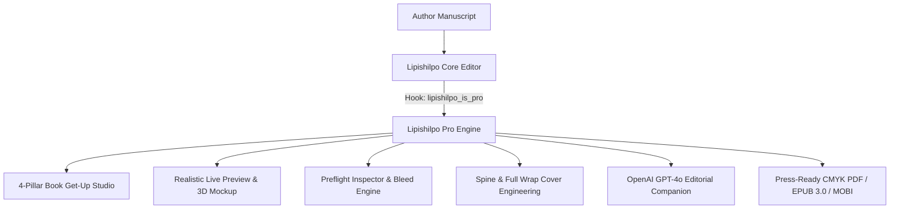

# 🌟 Lipishilpo Pro — Complete Feature & Architecture Documentation

> **Plugin Name:** Lipishilpo Pro (লিপিশিল্প প্রো)  
> **Type:** Professional Book Get-Up Studio, AI Editorial & Publication Add-on  
> **Parent Requirement:** [Lipishilpo (Free Version)](https://github.com/itsmanzur/lipishilpo)  
> **Repository:** `https://github.com/itsmanzur/lipishilpo-pro.git`  
> **Active Branch:** `lps-dev-h`  
> **License:** GPL-2.0-or-later  

---

## 📖 ১. পরিচিতি ও আর্কিটেকচার (Overview & Architecture)

**Lipishilpo Pro** হলো মূল **Lipishilpo** ফ্রি প্লাগিনের একটি প্রিমিয়াম এক্সটেনশন। এটি সাধারণ কোনো ওয়ার্ডপ্রেস প্লাগিন নয়, বরং **InDesign, Vellum, Atticus**-এর সমকক্ষ বাংলা বইয়ের পূর্ণাঙ্গ **বুক গেট-আপ, প্রকাশনা ও প্রিফ্লাইট স্টুডিও (Book Get-Up & Live Preview Studio)**।

### কোর আর্কিটেকচারাল পলিসি:
1. **Non-Intrusive Addon:** মূল ফ্রি প্লাগিনের কোনো কোর ফাইল পরিবর্তন ছাড়াই ওয়ার্ডপ্রেসের স্ট্যান্ডার্ড ফিল্টার হুক (`lipishilpo_is_pro`, `lipishilpo_fonts_url`, `lipishilpo_register_admin_settings`) ব্যবহার করে প্রো ফিচারসমূহ যুক্ত হয়।
2. **Dedicated OS-Grade Book Studio:** সাধারণ সাইডবার ক্লাটার দূর করে পূর্ণাঙ্গ স্ক্রিন জুড়ে ওএস-লেভেল ক্যানভাস ও স্টুডিও যেখানে রিয়েল-টাইম টু-পেজ স্প্রেড ও প্রেস প্রিভিউ দেখা যায়।
3. **Press-Ready Precision:** নিখুঁত মিলিমিটার ও পয়েন্ট স্কেলিং, ৩মিমি সেফ জোন, ৫মিমি ব্লীড, জিএসএম পেপার অনুযায়ী স্পাইন হিসাব ও ভেক্টর EAN-13 আইএসবিএন বারকোড ইন্টিগ্রেশন।
4. **Server-Side AI Proxy & Privacy:** ব্যবহারকারীর OpenAI API Key সার্ভারের `wp_options` টেবিলে সুরক্ষিত থাকে। ক্লায়েন্ট সাইডে কি এক্সপোজ হয় না।

---

## 🎨 ২. বুক গেট-আপ স্টুডিও (Book Get-Up & Layout Studio)

স্টুডিওটিকে ৪টি সুবিন্যস্ত, পেশাদার পিলারে (4-Pillar Classic Architecture) বিভক্ত করা হয়েছে:

### পিলার ১: লেআউট ও টাইপোগ্রাফি (Layout & Typography)
* **স্ট্যান্ডার্ড ও কাস্টম ট্রিম সাইজ (Book Trim Sizes):**
  - বাংলা প্রকাশনার জনপ্রিয় সাইজ: **A5** ($148 \times 210\text{ mm}$), **১/৮ ডিমাই / 1/8 Demy** ($138 \times 216\text{ mm}$), **ক্রাউন অক্টাভো / Crown Octavo** ($120 \times 184\text{ mm}$), **রয়্যাল / Royal** ($156 \times 234\text{ mm}$), **US Trade 6×9** ($152 \times 229\text{ mm}$) এবং কাস্টম সাইজ নির্বাচন।
* **মার্জিন ও গাটার ক্যালকুলেশন (Margins & Gutter):**
  - টপ, বটম, ইনসাইড ও আউটসাইড মার্জিনের পাশাপাশি বইয়ের বাঁধাইয়ের জন্য আলাদা **গাটার (Gutter Margin)** সেটিং।
* **বাংলা ফন্ট ও লিডিং কন্ট্রোল:**
  - কালপুরুষ, সোলাইমানলিপি, সূর্য, চারুলতা, কল্পনা ইত্যাদি বাংলা প্রিমিয়াম ফন্ট সিলেক্টর।
  - ফন্ট সাইজ (pt) ও লাইন হাইট (Leading ratio) রিয়েল-টাইমে পৃষ্ঠার বিন্যাসের সাথে সমন্বিত।

---

### পিলার ২: পৃষ্ঠা বিন্যাস ও সূচিপত্র (Pages & Dynamic TOC)
* **১-ক্লিক ডাইনামিক পেজ নাম্বারিং (Dynamic Page Numbering):**
  - **পজিশন:** নিচে মাঝে (Bottom Center), নিচে ডানে/বামে অল্টারনেট বা মিরর (Bottom Alternating Outside), উপরে হেডার (Top Header Outside)।
  - **ফরম্যাট:** বাংলা সাধারণ সংখ্যা (`১, ২, ৩`), ডেকোরেটিভ হাইফেন (`— ১২ —`), ডট বুলেট (`• ১২ •`), রোমান সংখ্যা (`i, ii, iii`)।
  - **স্মার্ট স্কিপ অপশন:** ফ্রন্ট ম্যাটার (টাইটেল, উৎসর্গ, কপিরাইট) ও সূচিপত্র পাতায় স্বয়ংক্রিয়ভাবে পেজ নম্বর লুকানোর ব্যবস্থা।
* **৫টি ইউনিক প্রিডিফাইন্ড সূচিপত্র ডিজাইন (TOC Presets):**
  1. **Classic Dotted Leader:** অধ্যায়ের নাম থেকে পৃষ্ঠার নম্বর পর্যন্ত ডট লাইন (`অধ্যায় ১ ........... ১২`)।
  2. **Minimalist Modern:** আধুনিক প্রকাশনার পরিচ্ছন্ন ও খোলামেলা ডান-বিন্যস্ত নম্বর।
  3. **Elegant Roman:** রোমান সংখ্যা ও সাবটাইটেল সমৃদ্ধ মার্জিত কাঠামো।
  4. **Romantic / Decorative:** কাব্যগ্রন্থ ও উপন্যাসের জন্য অলঙ্কৃত ভিন্টেজ ডিভাইডার সংবলিত সূচিপত্র।
  5. **Boxed Grid:** আধুনিক প্রযুক্তি বা নন-ফিকশন বইয়ের জন্য বক্সড গ্রিড লেআউট।
* **অধ্যায় শুরু ডিজাইন ও অলঙ্করণ (Chapter Opener & Motifs):**
  - **ড্রপ ক্যাপ (Drop Cap):** অধ্যায়ের প্রথম অক্ষরের ২/৩ লাইনের আকর্ষণীয় ড্রপ ক্যাপ।
  - **চ্যাপ্টার মোটিফ ডিভাইডার:** চ্যাপ্টার হেডারের নিচে ভিক্টোরিয়ান ফ্লোরাল, মিনিমাল ডিভাইডার বা জিওমেট্রিক মোটিফ যুক্ত করার সুবিধা।

---

### পিলার ৩: কভার ও স্পাইন ইঞ্জিনিয়ারিং (Cover & Spine Engineering)
* **স্বয়ংক্রিয় স্পাইন ক্যালকুলেটর (Paper GSM & Spine Calculator):**
  - কাগজের জিএসএম (65 GSM Newsprint, 70 GSM Offset, 80 GSM Premium, 100 GSM Art Paper), মোট পেজ কাউন্ট এবং বাইন্ডিং টাইপ (Paperback বা Hardcover Board) অনুযায়ী স্বয়ংক্রিয়ভাবে নিখুঁত মিলিমিটার স্পাইন (মেরুদণ্ড) পুরুত্ব পরিমাপ।
* **ফুল কভার র‍্যাপ জেনারেটর (Full Cover Wrap):**
  - সামনের কভার (Front Cover) + স্পাইন (Spine) + পেছনের কভার (Back Cover) + ব্লীড একসাথে যুক্ত করে ১টি সিঙ্গেল প্রিন্ট-রেডি কভার আর্টবোর্ড তৈরি।
* **ভেক্টর আইএসবিএন বারকোড ও মূল্য ট্যাগ (EAN-13 Barcode & Price):**
  - পেছনের কভারে অটোমেটিক ভেক্টর EAN-13 বারকোড ও মূল্য ট্যাগ বসানো।

---

### পিলার ৪: প্রিফ্লাইট ও প্রেস-রেডি এক্সপোর্ট (Preflight Quality Check & Export)
* **১-ক্লিক প্রিফ্লাইট ইন্সপেক্টর (Preflight Quality Inspector):**
  - বই প্রেসে পাঠানোর আগে স্বয়ংক্রিয়ভাবে স্ক্যান করে এরর/ওয়ার্নিং রিপোর্ট প্রদর্শন:
    - **Safe Zone Violation:** ৩ মিলিমিটারের কাটিং সীমানার বাইরে কোনো টেক্সট বা উপাদান আছে কি না।
    - **Bleed Error:** ব্যাকগ্রাউন্ড আর্ট ব্লীড লাইন পর্যন্ত বিস্তৃত কি না।
    - **Text Overflow:** পাতায় অতিরিক্ত টেক্সট নিচে কাটা পড়ছে কি না।
    - **Page Count & Imposition:** ফর্মা (Signature / ৮ বা ১৬ পাতার ভাঁজ) অনুযায়ী পেজ সংখ্যা বেজোড় বা অসামঞ্জস্যপূর্ণ কি না।
* **মাল্টি-ফরম্যাট এক্সপোর্ট:**
  - **Press-Ready PDF:** CMYK কালার প্রোফাইল, ক্রপ মার্ক (Crop Marks) ও ৫মিমি ব্লীড সংবলিত ভেক্টর পিডিএফ।
  - **Standard EPUB 3.0:** রিফ্লোয়েবল ও ফিক্সড লেআউট ই-বুক।
  - **Kindle MOBI / KPF:** অ্যামাজন কিন্ডল ফরম্যাট।
  - **MS Word (.docx):** প্রকাশনীর সম্পাদকের জন্য পরিপাটি ডক ফাইল।

---

## 🖥️ ৩. অ্যাডভান্সড লাইভ প্রিভিউ ইঞ্জিন (Interactive Preview Engine)

1. **বাস্তবধর্মী টু-পেজ স্প্রেড (2-Page Spread View):** পাশাপাশি দুটি পাতা (Left/Right Even-Odd Pages) পেজ টার্নিং শ্যাডো ও স্পাইন কার্ভসহ দেখার ব্যবস্থা।
2. **কাটিং ও সেফ জোন ওভারলে (Safe Zone Overlay):** প্রেসে কাটার লাইন (Trim Line), ৩মিমি সেফ এরিয়া এবং ৫মিমি ব্লীড জোন লাইভ প্রিভিউতে অন/অফ করার অপশন।
3. **রিয়েল-টাইম ৩ডি বুক মকআপ (3D Book Mockup):** বইয়ের কভার দিয়ে রিয়েল-টাইম ৩ডি বুক রূপ দেখার সুবিধা।
4. **মাল্টি-ডিভাইস সিমুলেশন:** প্রিন্ট পেপার, কিন্ডল ই-রিডার, ট্যাবলেট এবং মোবাইল স্ক্রিনে দেখার মোড।
5. **সেকশন ও চ্যাপ্টার ব্রাউজার:** ফ্রন্ট ম্যাটার (টাইটেল, কপিরাইট, উৎসর্গ), সূচিপত্র, অধ্যায়ের মূল পাঠ্য ও পরিশিষ্টের মধ্যে দ্রুত সুইচ করার ব্যবস্থা।

---

## 🤖 ৪. এআই এডিটোরিয়াল ও অডিও প্রুফরিডার (AI Companion & TTS)

1. **OpenAI GPT-4o এডিটোরিয়াল অ্যাসিস্ট্যান্ট (`AIPanel.tsx`):**
   - সাহিত্যিক প্রুফরিডিং (Proofread Mode), দৃশ্যের গতি ও টেনশন বিশ্লেষণ (Chapter Arc Mode), এবং পুরো উপন্যাসের প্লটহোল ও চরিত্রের ধারাবাহিকতা নিরীক্ষা (Whole-Book Continuity)।
2. **Text-to-Speech (TTS) অডিও প্রুফরিডার (`AudioProofreader.tsx`):**
   - বাংলা নিউরাল ভয়েসে পুরো চ্যাপ্টার পাঠ, রিয়েলটাইম সেন্টেন্স ফোকাস কার্সার এবং মাল্টি-স্পিড প্লেব্যাক।

---

## 🛠️ ৫. ব্যাকএন্ড এপিআই অ্যান্ডপয়েন্টস (Pro REST API Endpoints)

| মেথড | এন্ডপয়েন্ট | পারমিশন | কাজ |
| :--- | :--- | :--- | :--- |
| `GET` | `/wp-json/lipishilpo/v1/analyze` | `edit_posts` + valid license | AI এপিআই কি ও মডেল কনফিগারেশন স্ট্যাটাস চেক |
| `POST` | `/wp-json/lipishilpo/v1/analyze` | `edit_posts` + valid license + hourly rate limit | প্রুফরিড, চ্যাপ্টার এনালাইসিস এবং হোল-বুক ধারাবাহিকতা পরীক্ষা |
| `POST` | `/wp-json/lipishilpo/v1/analyze/test` | `manage_options` | OpenAI কানেকশন পিং |
| `GET` | `/wp-json/lipishilpo/v1/export/status` | `edit_posts` | লাইসেন্স ও ফন্ট-ভিত্তিক DOCX/PDF/EPUB স্ট্যাটাস |

---

## 📊 ৬. ফ্রি বনাম প্রো তুলনা (Free vs Pro Feature Matrix)

| ফিচার | ফ্রি ভার্সন (Free) | প্রো ভার্সন (Pro) |
| :--- | :---: | :---: |
| **চ্যাপ্টার ও বুক রাইটিং এডিটর** | ✅ | ✅ |
| **ডাইনামিক ফুলস্ক্রিন ও জিরো-রিলোড SPA** | ✅ | ✅ |
| **বাংলা টাইপোগ্রাফি ও ফন্ট সিলেক্টর** | ✅ | ✅ |
| **ডেইলি গোল ট্র্যাকার ও পোমোডোরো টাইমার** | ✅ | ✅ |
| **যুক্তবর্ণ চিটশিট ও চ্যাপ্টার নোটপ্যাড** | ✅ | ✅ |
| **বুক গেট-আপ স্টুডিও (৪-পিলার আর্কিটেকচার)** | ❌ | ✅ |
| **১-ক্লিক ডাইনামিক পেজ নাম্বারিং ও ফরম্যাটিং** | ❌ | ✅ |
| **৫টি ইউনিক প্রিডিফাইন্ড সূচিপত্র স্টাইল (TOC)** | ❌ | ✅ |
| **স্পাইন ও রিম পেপার ক্যালকুলেটর (GSM ভিত্তিক)** | ❌ | ✅ |
| **ফুল কভার র‍্যাপ (Front + Spine + Back + Bleed)** | ❌ | ✅ |
| **ভেক্টর EAN-13 আইএসবিএন বারকোড ও প্রাইস ট্যাগ** | ❌ | ✅ |
| **১-ক্লিক প্রিফ্লাইট কোয়ালিটি চেকার (Preflight Inspector)** | ❌ | ✅ |
| **বাস্তবধর্মী ২-পেজ স্প্রেড ও সেফ জোন ওভারলে** | ❌ | ✅ |
| **রিয়েল-টাইম ৩ডি বুক মকআপ সিমুলেশন** | ❌ | ✅ |
| **OpenAI GPT-4o সাহিত্যিক প্রুফরিডিং ও ধারাবাহিকতা** | ❌ | ✅ |
| **Text-to-Speech (TTS) অডিও প্রুফরিডার** | ❌ | ✅ |
| **প্রেস-রেডি CMYK PDF (ক্রপ মার্ক ও ব্লীড সহ)** | ❌ | ✅ |
| **কিন্ডল ও মোবাইল ফ্রেন্ডলি EPUB ৩.০ ই-বুক** | ❌ | ✅ |
