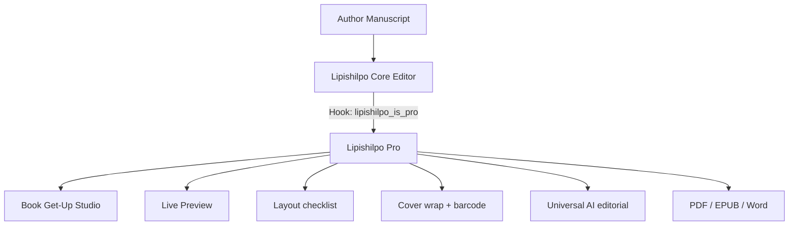

# Lipishilpo Pro — Feature & Architecture Documentation

> **Plugin Name:** Lipishilpo Pro (লিপিশিল্প প্রো)  
> **Type:** Book Get-Up Studio, AI editorial & publication add-on  
> **Parent:** [Lipishilpo (Free)](https://github.com/itsmanzur/lipishilpo)  
> **Repository:** `https://github.com/itsmanzur/lipishilpo-pro.git`  
> **License:** GPL-2.0-or-later  

---

## 1. Overview

**Lipishilpo Pro** extends the free manuscript editor with a Book Get-Up Studio, multi-provider AI, browser TTS, and PDF/EPUB/DOCX export.

**Studio gate:** without a license the studio UI stays **open as a demo**. Export (PDF, DOCX, EPUB, cover PDF) is locked. The UI is not fully hidden.

### Architecture
1. **Non-intrusive add-on:** hooks such as `lipishilpo_is_pro`, `lipishilpo_fonts_url`, `lipishilpo_register_admin_settings`.
2. **Fonts:** Pro ships Noto Serif Bengali, Hind Siliguri, Tiro Bangla, and Noto Serif (Latin) under SIL OFL. Preview CSS and PDF/EPUB embed the **same** family. Export status looks for fonts in the Pro folder first, then the free plugin folder.
3. **AI privacy:** API keys stay in `wp_options`. Analysis runs only when the author starts it. Provider is shown in the AI panel.

---

## 2. Book Get-Up Studio

### Layout & typography
- Trim sizes: Banglabazar Demy 1/8 (140×215), Royal (155×235), pocket Demy 1/16, A5, US Trade 6×9, Digest, B5, A4, custom mm.
- Inner/outer/top/bottom margins and gutter.
- **Exportable fonts only:** Noto Serif Bengali, Hind Siliguri, Tiro Bangla. Size (pt) and leading.

### Pages & TOC
- Page-number position: bottom/top, center or outside, or none.
- Styles: plain, dash, bracket, motif, circle. Numerals: Bengali `১, ২, ৩` or Western `1, 2, 3`. **Roman front-matter numerals (i, ii, iii) are not implemented.**
- Five TOC presets: classic dots, modern, ornamented, summary, minimal. **“Elegant Roman” TOC is not a separate engine.**
- Drop caps, chapter openers, scene-break motifs.

### Cover & spine
- Front and back **cover image upload** (compressed JPEG in the browser), colour fallback, optional title overlay on art.
- Spine width estimate from estimated page count and **70 / 80 / 100 GSM** paperback stock. **65 GSM newsprint and hardcover board thickness are not modelled.**
- Full wrap canvas (back + spine + front). Optional crop marks on PDF. Vector EAN-13 + price.

### Layout checklist (honest scope)
This is a **settings checklist**, not a press preflight RIP:
- Gutter vs estimated page count, line-height, crop-mark toggle, TOC, publisher/ISBN, unclosed `:::box` (error — export can drop the box), cover-art reminder.
- Score = `100 − warnings×12 − errors×25`. **`isPressReady` is always false.** There is no bleed/overflow/imposition scan.

Unlicensed users see a **Demo — export needs license** badge. Export pills stay disabled.

---

## 3. Live preview

Two-page spread, wrap, simple 3D mockup. Optional trim overlay. Kindle/tablet/mobile frames are simulations, not device exports.

---

## 4. Universal AI & browser TTS

1. **AI panel:** OpenAI, Google Gemini, Anthropic Claude, OpenRouter, or custom/local endpoint. Proofread, chapter, whole-book continuity. Status and reports show **provider + model**.
2. **Audio proofreader:** `speechSynthesis` in the browser. Voice `<select>`, speeds 0.75×–2.0×, live sentence highlight. **Not neural / cloud TTS.**

---

## 5. REST endpoints

| Method | Endpoint | Permission | Role |
| :--- | :--- | :--- | :--- |
| `GET` | `/wp-json/lipishilpo/v1/analyze` | `edit_posts` + license | Provider, key, model status |
| `POST` | `/wp-json/lipishilpo/v1/analyze` | same + rate limit | Proofread / chapter / book |
| `POST` | `/wp-json/lipishilpo/v1/analyze/test` | `manage_options` | Connection test |
| `GET` | `/wp-json/lipishilpo/v1/export/status` | `edit_posts` | License + font-ready flags |

---

## 6. Free vs Pro

| Feature | Free | Pro |
| :--- | :---: | :---: |
| Chapter editor, autosave, HTML/TXT/MD/JSON | ✅ | ✅ |
| Word (.docx) **import** | ✅ | ✅ |
| Book Get-Up Studio preview | ❌ | ✅ demo without license |
| PDF / EPUB / layout DOCX / cover PDF | ❌ | ✅ with license |
| Cover image, wrap, EAN-13 | ❌ | ✅ |
| Layout checklist | ❌ | ✅ (not press scan) |
| Universal AI | ❌ | ✅ |
| Browser TTS | ❌ | ✅ |

---

## 7. Install

1. Activate free Lipishilpo, then Lipishilpo Pro.
2. **Lipishilpo > Settings:** license key; optional AI provider + API key.
3. Open Book Studio from the editor. Demo preview works without a key; downloads do not.

Remote license validation and auto-update are **not** in this build.
