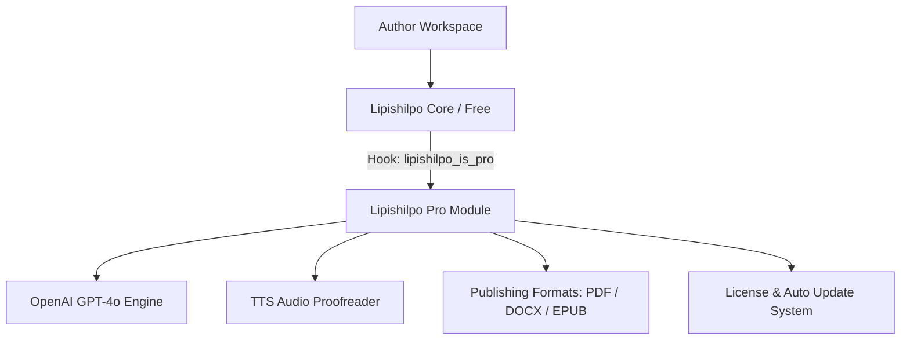

# 🌟 Lipishilpo Pro — Complete Feature & Architecture Documentation

> **Plugin Name:** Lipishilpo Pro (লিপিশিল্প প্রো)  
> **Type:** Premium Companion WordPress Plugin  
> **Parent Requirement:** [Lipishilpo (Free Version)](https://github.com/itsmanzur/lipishilpo)  
> **Repository:** `https://github.com/itsmanzur/lipishilpo-pro.git`  
> **License:** GPL-2.0-or-later  

---

## 📖 ১. পরিচিতি ও আর্কিটেকচার (Overview & Architecture)

**Lipishilpo Pro** হলো মূল **Lipishilpo** ফ্রি প্লাগিনের একটি প্রিমিয়াম এক্সটেনশন। ফ্রি ভার্সনে লেখক যে সম্পূর্ণ অফলাইন ও ডিস্ট্র্যাকশন-মুক্ত পরিবেশে পান্ডুলিপি তৈরি করেন, প্রো ভার্সন সেটিকে একটি **AI-পাওয়ার্ড এডিটোরিয়াল স্টুডিও** এবং **পাবলিকেশন পাওয়ারহাউস**-এ রূপান্তর করে।

### কোর আর্কিটেকচারাল পলিসি:
1. **Non-Intrusive Addon:** মূল ফ্রি প্লাগিনের কোনো কোর ফাইল পরিবর্তন ছাড়াই ওয়ার্ডপ্রেসের স্ট্যান্ডার্ড ফিল্টার হুক (`lipishilpo_is_pro`, `lipishilpo_fonts_url`, `lipishilpo_register_admin_settings`) ব্যবহার করে প্রো ফিচারসমূহ যুক্ত হয়।
2. **Server-Side AI Proxy:** ব্যবহারকারীর ওপেনএআই এপিআই কি (`OpenAI API Key`) ব্রাউজারে কখনো এক্সপোজ হয় না; এটি সার্ভারের `wp_options` টেবিলে সুরক্ষিত থাকে এবং ব্যাকএন্ড হয়ে প্রক্সি কলের মাধ্যমে কাজ করে।
3. **Manuscript Privacy:** শুধুমাত্র লেখক যখন ইচ্ছাকৃতভাবে কোনো চ্যাপ্টার বা বই অ্যানালাইসিস কমান্ড দেন, তখনই নিরাপদে সার্ভার টু সার্ভার এনক্রিপ্টেড রিকোয়েস্ট পাঠানো হয়।

---

## 🚀 ২. প্রো ভার্সনের মূল ফিচারসমূহ (Core Pro Features)

### ১. 🤖 Deep AI Editorial Companion (ওপেনএআই চালিত এডিটোরিয়াল অ্যাসিস্ট্যান্ট)
লিপিশিল্প প্রো-তে উন্নত OpenAI মডেল যেমন **GPT-4o**, **GPT-4o Mini**, এবং **o4-mini** সাপোর্ট করে। এটি বাংলা সাহিত্য এবং ইংরেজি উভয় ভাষার কাঠামো গভীরভাবে বুঝতে পারে।

* **প্রুফরিড ও ভাষা পরিশোধন (Proofread Mode):**
  - বানান, যতিচিহ্ন (বিরামচিহ্ন), ব্যাকরণগত অসঙ্গতি ও বাক্যগঠনের অস্পষ্টতা স্বয়ংক্রিয়ভাবে শনাক্ত করে।
  - ডায়ালগ বা চরিত্রের নিজস্ব কথ্য ভাষাকে বিকৃত না করে সাহিত্যিক শুদ্ধতা বজায় রাখে।
  - লেখকের চ্যাপ্টারের মূল বাক্যের সাথে নিখুঁতভাবে সাবস্ট্রিং গ্রাউন্ডিং করে রিপ্লেসমেন্ট প্রস্তাব করে।
* **চ্যাপ্টার ও দৃশ্য বিশ্লেষণ (Chapter & Narrative Arc Mode):**
  - দৃশ্যের গতি (Pacing), টেনশন কার্ভ, চরিত্রগুলোর মোটিভেশন এবং বর্ণনার সুর (Voice & Tone) বিশ্লেষণ করে।
  - দৃশ্যটি পাঠকের কাছে কেমন অনুভূতি তৈরি করবে এবং কোথায় কাহিনীর ছন্দপতন ঘটছে তা তুলে ধরে।
* **সমগ্র বইয়ের ধারাবাহিকতা রক্ষা (Whole-Book Continuity & Plot Tracking):**
  - উপন্যাসের প্রতিটি চ্যাপ্টারের অটো-ডাইজেস্ট লেজার তৈরি করে।
  - চ্যাপ্টার ১ থেকে শেষ চ্যাপ্টার পর্যন্ত চরিত্রের বয়স, সম্পর্ক, টাইমলাইন এবং কাহিনীর কোনো প্লটহোল (Contradiction) থাকলে চ্যাপ্টার নম্বর ও কোটেশনসহ বের করে দেয়।

---

### ২. 🎧 Text-to-Speech (TTS) অডিও প্রুফরিডার (Audio Proofreading Engine)
লেখার ভুল চোখে পড়ার চেয়ে কানে শুনে ধরা অনেক বেশি সহজ ও কার্যকর।

* **বাংলা ও ইংরেজি ভয়েস সিন্থেসিস:** উচ্চমানের নিউরাল ভয়েসে পুরো চ্যাপ্টার পাঠ করার সুবিধা।
* **রিয়েলটাইম ফোকাস কার্সার:** অডিওতে যে বাক্যটি উচ্চারিত হচ্ছে, এডিটরে সেই বাক্যটি স্বয়ংক্রিয়ভাবে হাইলাইট হয়ে স্ক্রল করে।
* **মাল্টি-স্পিড প্লেব্যাক কন্ট্রোল:** `0.75x`, `1.0x`, `1.25x`, `1.5x`, `2.0x` গতিতে শোনার সুবিধা।

---

### ৩. 📚 প্রিন্ট ও ই-বুক পাবলিকেশন এক্সপোর্ট (Book Publication Exports)
পান্ডুলিপির কাজ শেষ হলে প্রকাশনীর কাছে জমা দেওয়া বা সরাসরি ডিজিটাল বিক্রির জন্য লিপিশিল্প প্রো ১-ক্লিকে প্রফেশনাল ফাইল তৈরি করে।

| ফরম্যাট | বিস্তারিত বিবরণ |
| :--- | :--- |
| **📄 Print-Ready PDF** | বইয়ের স্ট্যান্ডার্ড সাইজ (A5, B5, Crown Quarto, US Trade 6×9), মার্জিন, মিরর পেজিং, স্বয়ংক্রিয় হেডার-ফুটার ও পৃষ্ঠা নম্বরসহ প্রিন্ট করার উপযোগী প্রিমিয়াম বাংলা ফন্ট এমবেডেড ফাইল। |
| **📝 MS Word (.docx)** | প্রকাশনীর সম্পাদকের জন্য চ্যাপ্টার ব্রেক, ফ্রন্ট ম্যাটার ও স্ট্যান্ডার্ড টাইপোগ্রাফি স্টাইল সংবলিত পরিপাটি ডক ফাইল। |
| **📱 Standard EPUB** | অ্যামাজন কিন্ডল (Kindle), অ্যাপল বুকস (Apple Books) ও গুগল প্লে বুকসের মানদণ্ড অনুযায়ী কভার, টেবিল অব কন্টেন্টস (TOC) ও রিফ্লোয়েবল চ্যাপ্টার সংবলিত ই-বুক। |
| **📑 অটোমেটেড ফ্রন্ট ম্যাটার** | বইয়ের নাম পাতা (Title Page), উৎসর্গ, কপিরাইট ঘোষণা এবং স্বয়ংক্রিয় সূচিপত্র যোগ করার বিল্ট-ইন জেনারেটর। |

---

### ৪. ⚙️ অ্যাডমিন কনফিগারেশন ও লাইসেন্স ম্যানেজার (Admin & License Suite)
* **API Key Management:** পাসওয়ার্ড ফিল্ড ও মাস্কিং সিকিউরিটি সহ এপিআই কি সংরক্ষণ।
* **Realtime Connection Checker:** সেটিংস পেইজ থেকেই ১-ক্লিকে ওপেনএআই সার্ভার কানেক্টিভিটি টেস্ট করার সুবিধা।
* **Pro License Verification:** লাইসেন্স কি অ্যাক্টিভেশন ও ওয়ান-ক্লিক অটোমেটিক আপডেট সাপোর্ট।

---

## 🛠️ ৩. ব্যাকএন্ড এপিআই অ্যান্ডপয়েন্টস (Pro REST API Endpoints)

লিপিশিল্প প্রো নিচের সুরক্ষিত REST রুটগুলো সক্রিয় করে:

| মেথড | এন্ডপয়েন্ট | পারমিশন | কাজ |
| :--- | :--- | :--- | :--- |
| `GET` | `/wp-json/lipishilpo/v1/analyze` | Logged-in User | AI এপিআই কি ও মডেল কনফিগারেশন স্ট্যাটাস চেক |
| `POST` | `/wp-json/lipishilpo/v1/analyze` | Logged-in User | প্রুফরিড, চ্যাপ্টার এনালাইসিস এবং হোল-বুক ধারাবাহিকতা পরীক্ষা |
| `GET` | `/wp-json/lipishilpo/v1/export/status` | Logged-in User | DOCX, PDF, EPUB এক্সপোর্ট মডিউলের প্রস্তুতি স্ট্যাটাস চেক |

---

## 📊 ৪. ফ্রি বনাম প্রো তুলনা (Free vs Pro Matrix)

| ফিচার | ফ্রি ভার্সন (Free) | প্রো ভার্সন (Pro) |
| :--- | :---: | :---: |
| **চ্যাপ্টার ও বুক রাইটিং স্টুডিও** | ✅ | ✅ |
| **ডাইনামিক ফুলস্ক্রিন ও জিরো-রিলোড SPA** | ✅ | ✅ |
| **বাংলা টাইপোগ্রাফি ও ফন্ট সিলেক্টর (৬টি ফন্ট)** | ✅ | ✅ |
| **ডেইলি গোল ট্র্যাকার ও পোমোডোরো টাইমার** | ✅ | ✅ |
| **যুক্তবর্ণ চিটশিট ও চ্যাপ্টার নোটপ্যাড** | ✅ | ✅ |
| **ওয়ার্ডপ্রেস পোস্টে ১-ক্লিক পাবলিশ** | ✅ | ✅ |
| **অফলাইন JSON ব্যাকআপ ও রিস্টোর** | ✅ | ✅ |
| **OpenAI GPT-4o সাহিত্যিক প্রুফরিডিং** | ❌ | ✅ |
| **চ্যাপ্টার টেনশন ও বর্ণনার গতি বিশ্লেষণ** | ❌ | ✅ |
| **পুরো বইয়ের চরিত্র ও প্লটের ধারাবাহিকতা যাচাই** | ❌ | ✅ |
| **Text-to-Speech (TTS) অডিও প্রুফরিডার** | ❌ | ✅ |
| **প্রিন্ট-রেডি PDF এক্সপোর্ট (লেআউট ও পেজিং)** | ❌ | ✅ |
| **MS Word (.docx) এক্সপোর্ট** | ❌ | ✅ |
| **কিন্ডল ও মোবাইল ফ্রেন্ডলি EPUB ই-বুক** | ❌ | ✅ |
| **অটোমেটেড বুক ফ্রন্ট ম্যাটার ও সূচিপত্র** | ❌ | ✅ |

---

## 🔒 ৫. নিরাপত্তা ও ডেটা প্রটেকশন (Security & Privacy)

1. **WordPress Security Standards:** প্রতিটি এপিআই কলে `wp_verify_nonce` এবং `is_user_logged_in()` ভ্যালিডেশন বাধ্যতামূলক।
2. **Sanitization & Escaping:** ইনপুট ও আউটপুট তৈরিতে `sanitize_text_field` এবং `wp_json_encode` কঠোরভাবে অনুসরণ করা হয়।
3. **No External Server Dependency (for Exports):** এক্সপোর্ট ফাইল জেনারেশনে থার্ড পার্টি ক্লাউড সার্ভারের ওপর নির্ভরশীল না হয়ে স্বয়ংক্রিয়ভাবে স্ট্যান্ডার্ড প্রসেসিং বজায় রাখে।

---

## 🚀 ৬. ইনস্টলেশন ও ব্যবহার নির্দেশিকা

1. প্রথমে মূল [Lipishilpo](https://github.com/itsmanzur/lipishilpo) ফ্রি প্লাগিন ইনস্টল ও সক্রিয় করুন।
2. `lipishilpo-pro` প্লাগিন ফোল্ডারটি `/wp-content/plugins/` ডিরেক্টরিতে আপলোড করুন এবং সক্রিয় করুন।
3. ওয়ার্ডপ্রেস অ্যাডমিনের **Lipishilpo > Settings** এ গিয়ে আপনার **OpenAI API Key** বসান এবং **Test Connection** বাটনে ক্লিক করে কানেক্টিভিটি নিশ্চিত করুন।
4. ব্যস! এখন লিপিশিল্প এডিটরে ওপেনএআই অ্যাসিস্ট্যান্ট, অডিও প্রুফরিডার এবং পাবলিকেশন এক্সপোর্ট সক্রিয় হয়ে যাবে।
